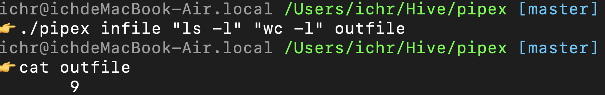

<h1 align="center">
	✏️ pipex
</h1>

<p align="center">
	<b><i>Project to mimic pipe's behavior.</i></b><br>
</p>

<h3 align="center">
		<a href="#-about-the-project">About</a>
		<span> · </span>
		<a href="#-features-of-the-project">Features</a>
		<span> · </span>
		<a href="#-requirements">Requirements</a>
		<span> · </span>
		<a href="#-instructions">Instructions</a>
		<span> · </span>
		<a href="#-learning-goals">Learning Goals</a>
		<span> · </span>
		<a href="#-project-structure">Project Structure</a>
</h3>

---

## 💡 About the project

> pipex is a project that recreates the behavior of the shell's pipeline (|) by executing two commands where the output of the first command is used as the input of the second command. The project deepens understanding of Unix file descriptors, pipes, and process creation using fork() and execve().

### How it works
- The program takes an input file, two commands, and an output file as arguments.
- It redirects the input file to the first command and pipes the output to the second command.
- The result is written to the output file.
Equivalent to running in a shell:
```bash
< infile cmd1 | cmd2 > outfile
```
## 🌟 Features of the Project
- Executes two commands in a pipeline fashion.
- Uses fork(), pipe(), dup2(), and execve() to manage processes and redirections.
- Supports absolute and relative paths for commands.
- Error handling for invalid commands or file operations.
- Extended bonus version supporting multiple pipes (cmd1 | cmd2 | ... | cmdN).

## 🛠️ Requirements

The project is written in C and uses system calls for process management. It requires:
- **`gcc`** compiler
- **Standard C libraries**, including `fcntl.h`, `sys/wait.h`

## 🔧 Instructions

### 1. Compiling the project

To compile the project, navigate to the project directory and run:<br>
>Tip: Some users might encounter errors when running the following commands in the VSCode terminal on Mac M1. However, using the original Terminal app on macOS can resolve the issue.

```shell
$ make
```

Other make-files-commands:
```shell
$ make bonus   # Compile with multiple pipes support
$ make clean   # Remove object files
$ make fclean  # Remove executable and object files
$ make re      # Recompile the project
```
**2. Using the program**

After compiling, you can use the push_swap program to sort a list of integers:
```
$ ./pipex infile "cmd1" "cmd2" outfile
```
example:
```
$ ./pipex input.txt "cat" "wc -l" output.txt
```

## 🎯 Learning Goals
- This project helps develop:
	- Process management: Using fork(), execve(), and waitpid() for process execution.
	- Inter-process communication: Utilizing pipe() to create data flow between commands.
	- File redirection: Handling file descriptors with dup2().
	- Error handling: Managing system calls and error messages properly.

## 📂 Project Structure
```
.
├── README.md
├── includes
│   └── pipex.h
├── lib
└── src
    ├── child_process.c
    ├── close.c
    ├── error.c
    ├── main.c
    ├── path_finder.c
    └── tool.c
```
## 📸 screen shot

